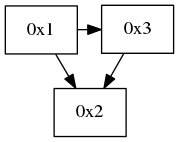

# topology レポート課題

## 課題

* topology を改造し，スイッチに加えてホストの接続関係を表示するコントローラを作る
* パケットを出したホストの IP アドレスを楕円で表示

## 回答
### プログラムの変更点
題意を実現するために変更を施したファイルを以下に示す．

#### topology.rb
Topology クラスではスイッチに接続されているホスト情報を管理するインスタンス変数 `@hosts` が定義されており，ホストがパケットを送信した段階でそのホストの接続情報が追加される．したがって`topology.rb`においては，画像の描写クラスから`@hosts`を参照できるよう変更するだけでよく，具体的には Topology クラスに次のRead属性を追加した．

```ruby
  attr_reader :hosts
```

#### graphviz.rb
`graphviz.rb`にはトポロジ画像を出力するための`Graphviz`クラスが定義されている．本課題では接続されたホストを描画するため，`Graphviz#update`メソッドに次の処理を追記した．処理としては，接続されているホスト毎に IP アドレスをラベルとして楕円で描画し，そのホストと接続されているスイッチとの間にエッジを描画している．

```ruby
topology.hosts.each do |each|
	ip_address = each[1].to_s
	dpid = each[2]
	host = gviz.add_nodes(ip_address, shape: 'ellipse')
	next unless nodes[dpid]
	gviz.add_edges host, nodes[dpid]
end
```

#### Gemfile
最新版（v0.8.3）の Trema では仮想ホストに関するモジュールにバグが報告されており，現段階では意図的に Trema のバージョンを下げて課題の実現を図った．使用する Trema のバージョンをバグのない v0.8.0 に下げるため，`Gemfile` の Trema の指定を次のように変更した．

```
gem 'trema','0.8.0'
```

### 動作確認
`mytopology.conf` という名前で新たなトポロジ設定ファイルを作成し，接続されているホストが描画されるかどうか確認を行った．`mytopology.conf`では，スイッチ 3 台を三角形を構成するよう接続し，そのうち 2 台のスイッチに 1 台ずつホストを接続する設定を行った．以下に設定ファイルの記述を示す．

```
vswitch { dpid '0x1' }
vswitch { dpid '0x2' }
vswitch { dpid '0x3' }

vhost('host1') {
  ip '192.168.0.1'
} 
vhost('host2') {
  ip '192.168.0.2'
}

link '0x1', '0x2'
link '0x2', '0x3'
link '0x3', '0x1'

link '0x1', 'host1'
link '0x2', 'host2'
```

得られたトポロジ画像を以下に示す．

* コントローラ起動時
	* 
* host1 から host2 にパケットを送った直後
	* 
* host2 から host1 にパケットを送った直後
	* 

このように正しい動作が確認された．
